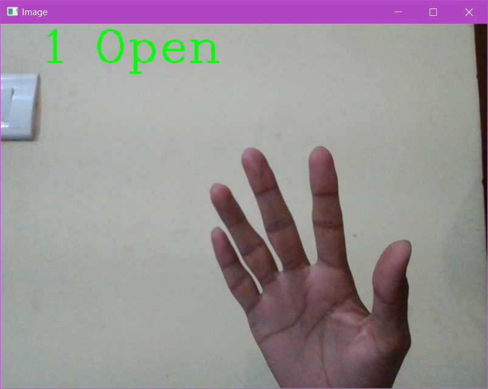
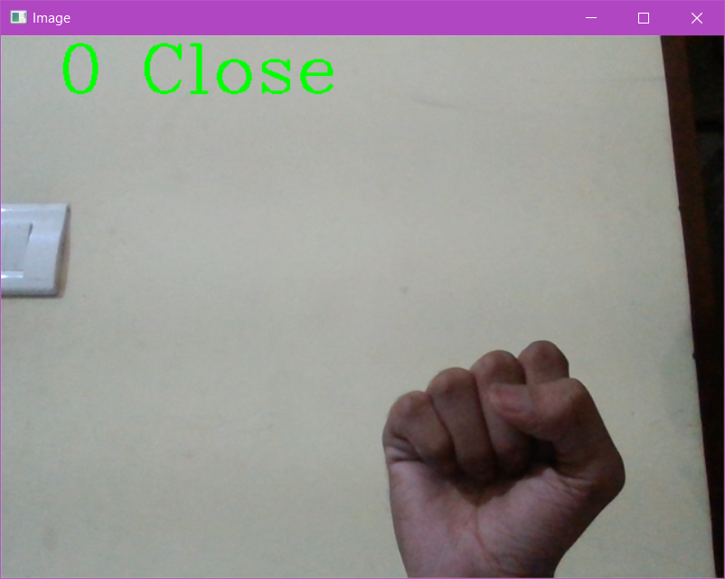

# Realtime Hand Gesture Detection
A working computer vision project to detect simple hand gestures like fist and open hand. It uses webcam to capture frames in real time and detect the gesture. Built using Teachable Machine on custom hand gesture dataset.

## Installation
I have tested this project on python 3.6 and 3.7. If it does not work on latest version of python then install 3.6 or 3.7. Enter following command in command prompt to check the version of python installation  
```
python --version
```
###### Install pip (python package manager)
1. Pip is installed by default on many newer Python builds. To check and see if it is already installed on our system, open a command prompt and type the following command. -> `pip help`
2. If pip is not found install it using this tutorial: https://www.liquidweb.com/kb/install-pip-windows/

###### Install Tensorflow
Open command prompt and enter following command 
```
pip install tensorflow
```
Tensorflow is a large pacakage so it might take some time to install.

###### Install Numpy
```
pip install numpy
```
###### Install OpenCV for Python
```
pip install opencv-python
```
###### Install cvzone 1.3.3
This project requires version 1.3.3 of cvzone
```
pip install cvzone==1.3.3
```

## Working
Clone the project using git or downlad and unzip into a folder.
Open command prompt and enter following command with the path to the project folder where main.py is located:
```
cd "enter path here"
```
Now command prompt should be in the project directory. Run main.py using following command:
```
python main.py
```
A window will open with webcam interface and you can test hand gestures in real time. 
--------------------------------------
<!-- 
 -->
<p align="center">
  
  
</p>

If it shows error after running the main.py file, make sure that webcam is on and working and it is not being used by another application.

_**To close the webcam interface just close the command prompt window where main python script is running.**_
